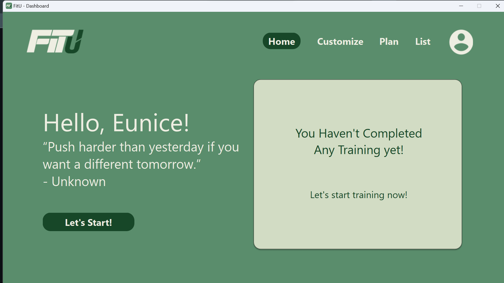
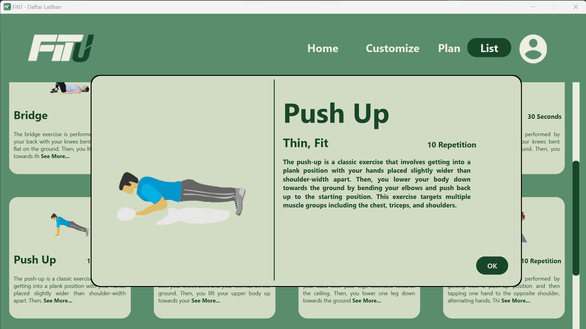
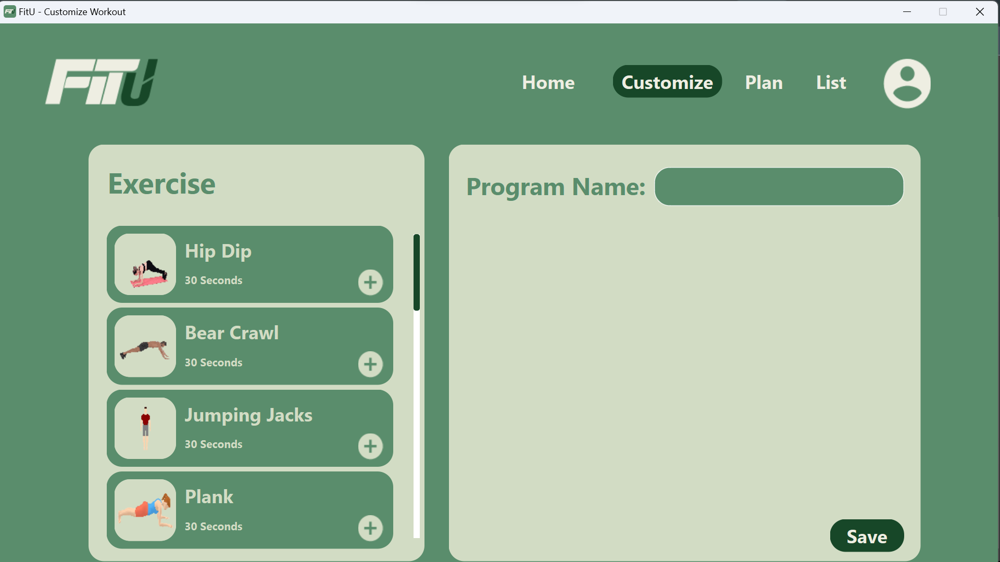
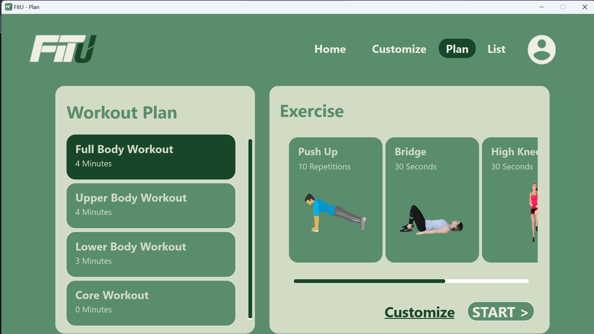
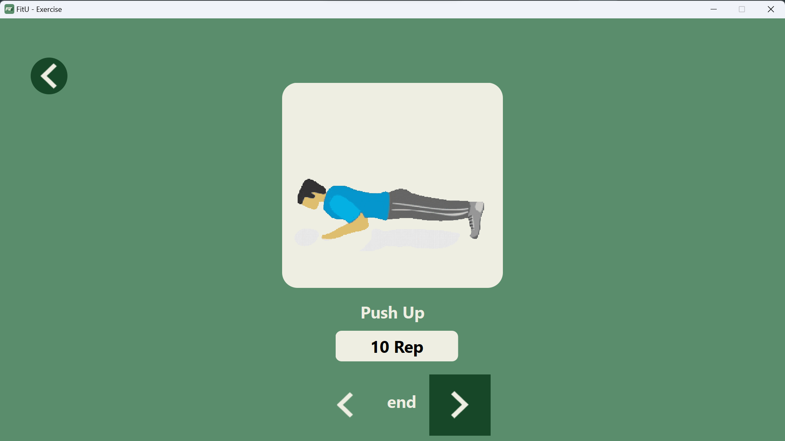

# FitU

FitU merupakan sebuah aplikasi desktop yang dapat membantu pengguna untuk menyusun program olahraga secara pribadi. Aplikasi FitU dibuat dan dikembangkan dengan bahasa Pemrograman Python.

## Fitur

Aplikasi FitU memiliki beberapa fitur, yaitu:

- Register
- Dashboard
- List Of Exercise
- Customize Exercise
- Recomendation Of Exercise Program
- Exercise
- History Of Exercise

## _Requirement_

- Python3
- _library_:
  - PyQt6
  - sqlite3
  - pytest

## Cara Menjalankan Aplikasi

### Untuk Windows

Klik file ```run.bat```


## Daftar Modul yang Diimplementasikan

|      Nama Modul      |      NIM Penanggung Jawab      |                 Nama Penanggung Jawab                 |
| -------------------- | ------------------------------ | ----------------------------------------------------- |
| Registrasi           | 13521013                       | Eunice Sarah Siregar                                  |
| Dashboard            | 13521027                       | Agsha Athalla Nurkareem                               |
| Daftar Latihan       | 13521011                       | Afnan Edsa Ramadhan                                   |
| Kustomisasi Latihan  | 13521014                       | Muhhamad Syauqi Jannatan                              |
| Rencana Latihan      | 13521010 </br> 13521013             | Muhamad Salman Hakim Alfarisi </br> Eunice Sarah Siregar   |

### Registrasi


### Dashboard



### Daftar Latihan



### Kustomisasi Latihan



### Rencana Latihan





## Daftar Tabel Basis data yang Diimplementasikan

- user = (**name**, height, weight, goal, gender, age)
- daftar_latihan = (**exercise_id**, title, description, goals, duration, repetition, gif)
- latihan_program = (program_id, exercise_id)
- program = (**program_id**, title_program)
- riwayat_latihan = (**history_id**, program_id, name, title_program, calories, date, tot_duration)
